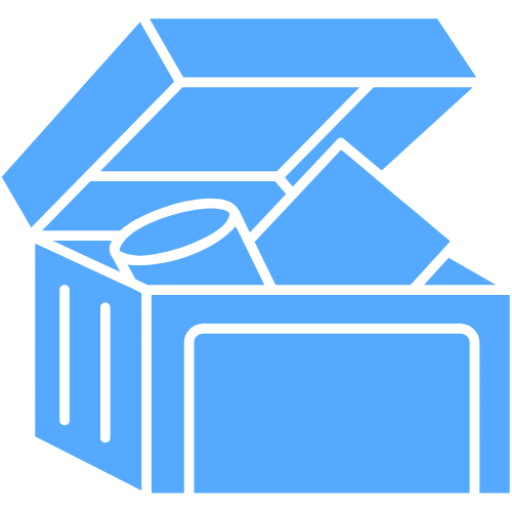

<p align="center">
  
</p>

<h1 align="center">Loot Blog 🕹️</h1>
<p align="center"><i>Level up your thoughts. Drop your loot. Share your story.</i></p>

---

Welcome to **Loot Blog**, a video game-themed mini blog system built with the mighty <a href="https://laravel.com">Laravel</a> and <a href="https://laravel.com/docs/starter-kits#laravel-breeze">Laravel Breeze</a>!  
Here, every user is an adventurer—post your quests, collect comments as loot, and build your legend.

---

## ✨ Features

-   **User authentication** (register/login with Laravel Breeze)
-   **Create, edit, and delete blog posts**
-   **Comment on posts**
-   **Authorization** – only authors can edit/delete their own posts/comments
-   **Clean Tailwind CSS styling** with a dashboard layout
-   **Easy local development** (Laravel + Vite)
-   **GitHub-friendly structure**

---

## 📦 Requirements

-   PHP >= 8.1
-   Composer
-   Node.js & npm
-   MySQL or other supported database

---

## 🚀 Installation

1. **Clone the repository**

    ```bash
    git clone https://github.com/MikhailAquino/Loot-Blog.git
    cd Loot-Blog
    ```

2. **Install PHP dependencies**

    ```bash
    composer install
    ```

3. **Install JavaScript/CSS dependencies**

    ```bash
    npm install
    ```

4. **Copy the `.env` file and generate app key**

    ```bash
    cp .env.example .env
    php artisan key:generate
    ```

5. **Configure your `.env` database credentials:**

    ```
    DB_CONNECTION=mysql
    DB_HOST=127.0.0.1
    DB_PORT=3306
    DB_DATABASE=loot_blog
    DB_USERNAME=your_username
    DB_PASSWORD=your_password
    ```

6. **Run the migrations**

    ```bash
    php artisan migrate
    ```

7. **(Optional) Seed demo posts**

    ```bash
    php artisan db:seed --class=PostSeeder
    ```

8. **Start the servers**

    - In one terminal:
        ```bash
        php artisan serve
        ```
    - In another:
        ```bash
        npm run dev
        ```

9. Open [http://127.0.0.1:8000](http://127.0.0.1:8000) in your browser.

---

## 🗂️ Project Structure

-   `routes/web.php` – web application routes
-   `app/Http/Controllers` – controllers (Posts, Comments, Auth, Profile)
-   `resources/views` – Blade templates for dashboard, posts, comments
-   `public/` – public assets (favicon, images, etc.)
-   `database/migrations` – database schema
-   `database/seeders` – sample/demo data

---

## 🔐 Authentication

This project uses **Laravel Breeze** for simple, robust authentication.  
Register and log in to access the dashboard and blog features.

---

## 🤝 Contributing

PRs are welcome! To propose a change, fork the repo and submit a pull request.  
Please follow the [Laravel contribution guide](https://laravel.com/docs/contributions).

---

## 🛡️ Security

If you discover a vulnerability, please open an issue or contact the maintainer directly.

---

## 📄 License

This project is open-source and available under the [MIT license](https://opensource.org/licenses/MIT).

---

## 🙏 Credits

-   [Laravel](https://laravel.com/)
-   [Laravel Breeze](https://laravel.com/docs/starter-kits#laravel-breeze)
-   [Tailwind CSS](https://tailwindcss.com/)
